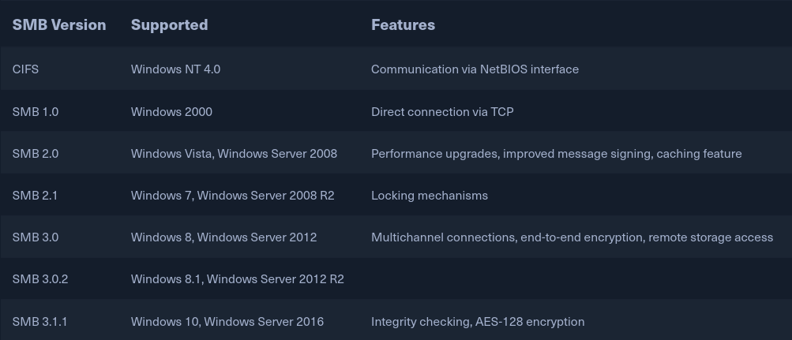

# SMB

SMB (Server Message Block) known as Samba(variant) on UNIX was developed by IBM and modified by Microsoft.

<figure><figcaption></figcaption></figure>

Passing SMB commands over Samba to an older NetBIOS service, usually connects to the Samba server over TCP ports `137`, `138`, `139`, but CIFS (Common Internet File System) uses TCP port `445` only.


SMBClient - Connecting to the share

```bash
smbclient -N -L //<target-ip>
```

* \-N specifies null session, which is anonymous access without the input of existing user credentials.
* \-L Displays a list of the server's shares with the SMBClient command from our host.

```bash
smbclient -N //<target-ip>/<share-name>
```

Login directly to the share by it's name.


SMB can be used to communicate with the local system by using

```bash
!<command>
```


### RPCclient

Should be utilized as it's an excellent tool for enumeration of SMB/Samba.

```bash
rpcclient -U "" <target-ip>
```

| **Query**                 | **Description**                                                    |
| ------------------------- | ------------------------------------------------------------------ |
| `srvinfo`                 | Server information.                                                |
| `enumdomains`             | Enumerate all domains that are deployed in the network.            |
| `querydominfo`            | Provides domain, server, and user information of deployed domains. |
| `netshareenumall`         | Enumerates all available shares.                                   |
| `netsharegetinfo <share>` | Provides information about a specific share.                       |
| `enumdomusers`            | Enumerates all domain users.                                       |
| `queryuser <RID>`         | Provides information about a specific user.                        |


### Brute Forcing User RIDs

```bash
for i in $(seq 500 1100);do rpcclient -N -U "" <target-ip> -c "queryuser 0x$(printf '%x\n' $i)" | grep "User Name\|user_rid\|group_rid" && echo "";done
```

Alternative tools include

* Impacket's [samrdump.py](https://github.com/fortra/impacket/blob/master/examples/samrdump.py)

```bash
samrdump.py <target-ip>
```

* SMBMap

```bash
smbmap -H <target-ip>
```

* CrackMapExec

```bash
crackmapexec smb 10.129.14.128 --shares -u '' -p ''
```

* Enum4Linux-ng

```bash
./enum4linux-ng.py 10.129.14.128 -A
```
